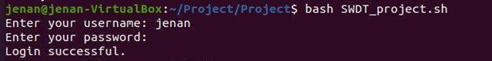
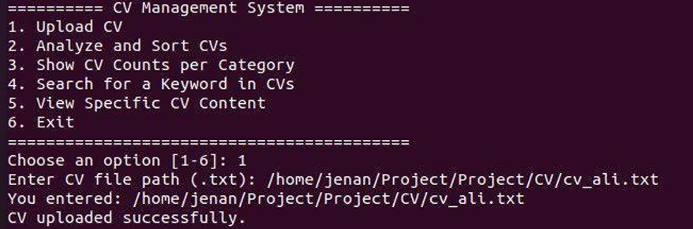
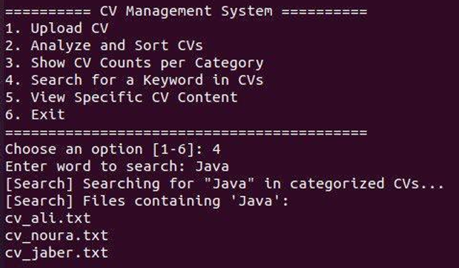
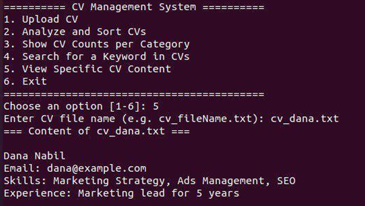
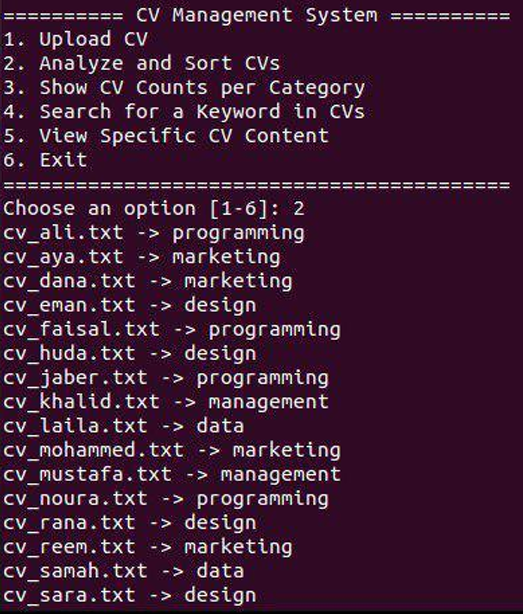

# 📂 CV Management System (Bash-Based)

A command-line application built using **Bash scripting** to efficiently manage and organize CVs (resumes).  
The system allows users to **upload, categorize, search, and view CVs** using keyword-based classification.

---

## ✨ Features

- 🔐 User Authentication (Login / Signup)  
- 📤 Upload CV files  
- 🗂 Automatic categorization using keywords  
- 🔎 Search CVs by keyword  
- 📊 Count CVs per category  
- 📄 View CV content  
- 💻 Interactive menu-driven interface  

---

## 🛠 Technologies Used

- **Language:** Bash (Shell Scripting)  
- **Environment:** Linux Terminal  
- **Core Commands:**  
  - `grep` (search inside files)  
  - `mkdir` (create directories)  
  - `cp` (copy files)  
  - `read` (user input)  

---

## 🧹 System Workflow

The system follows these steps:

1. Initialize environment (folders & files)  
2. User login or signup  
3. Upload CV  
4. Categorize CV using keywords  
5. Search and view results  

---

## ⚙️ Key Functionalities

### 🔐 User Authentication
- Secure login system  
- Account creation for new users  

📸 **Screenshot:**  


---

### 📤 Upload CV
- User provides file path  
- System verifies file existence  
- CV stored in the system  

📸 **Screenshot:**  


---

### 🗂 CV Categorization
- Reads keywords from `keywords.txt`  
- Automatically sorts CVs into category folders  

📸 **Screenshots:**  
  


---

### 🔎 Search Function
- Search across all CVs  
- Uses `grep` for fast keyword matching  

📸 **Screenshot:**  


---

### 📊 CV Count
- Displays number of CVs in each category  

📸 **Screenshot:**  


---

### 📄 View CV
- Displays content of selected CV  

📸 **Screenshot:**  


---

## 🧪 Testing & Results

All system functionalities were successfully tested:

- ✔️ File upload works correctly  
- ✔️ Accurate CV categorization  
- ✔️ Fast keyword search  
- ✔️ Simple and user-friendly interface  

📸 **Screenshots:**  
  


---

## 💡 Key Insights

- Bash scripting is powerful for automation tasks  
- File-based organization improves efficiency  
- Keyword-based classification simplifies CV sorting  
- `grep` is highly effective for searching  

---

## 🎯 Project Purpose

- Improve CV management efficiency  
- Reduce time spent searching for resumes  
- Practice Bash scripting in a real-world scenario  
- Build a simple and functional system  

---

## ⚠️ Limitations

- File-based storage (not highly secure or scalable)  
- No graphical user interface (GUI)  
- Limited error handling  

---

## ⭐ Future Work

- Integrate a database (MySQL / SQLite)  
- Develop a web-based interface  
- Add AI-based CV analysis  
- Improve search with advanced filtering  

---

## 🚀 How to Run

```bash
chmod +x script.sh
./script.sh
```

---

## 👥 Team Members

- Jenan Hatim Bajawi  
- Linda Hussain Alzahrani  
- Raghad Ahmad Alzahrani  
- Salam Ali Alghamdi  
- Khadija Ali Mirza  

---

## 📁 Project Structure

```
CV-Management/
│── script.sh
│── keywords.txt
│── users.txt
│── cv_storage/
│── categorized/
│── images/
```

---

## 📸 Notes

- Add all screenshots inside the `images/` folder  
- Use clear and high-quality images  
- Include before/after results for better presentation  

---
